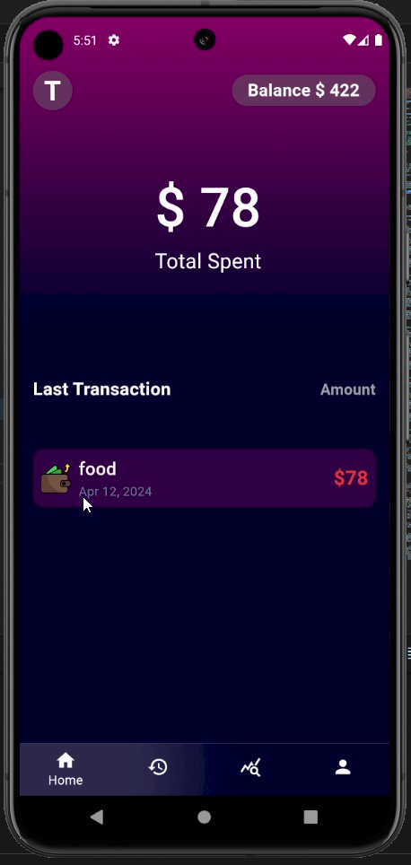
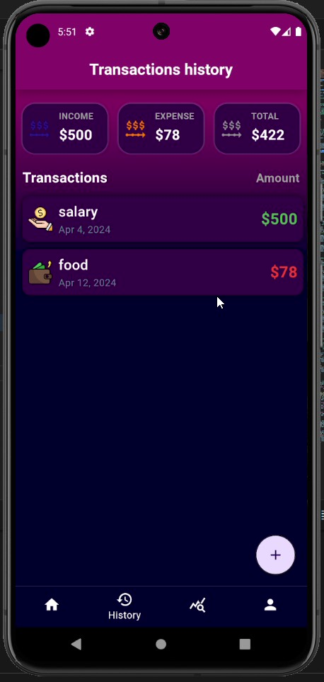
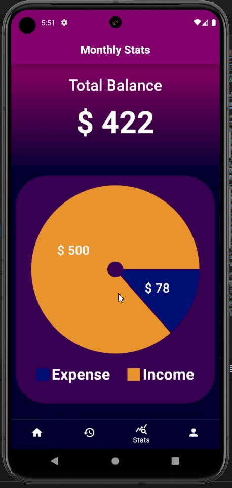

Certainly! Here's a detailed README for your GitHub project "Flousak":

---

# Flousak - Money Manager App

Flousak is a comprehensive mobile application designed to help users manage their finances effectively. Built with Flutter, Dart, and Firebase, Flousak allows users to track their income, expenses, and savings, providing valuable insights into their financial health.

## Features

- **User Authentication:** Secure login and registration using Firebase Authentication.
- **Real-time Data Syncing:** Seamless integration with Firebase Firestore for real-time data storage and retrieval.
- **Expense Tracking:** Categorize and monitor expenses with detailed analytics and visualizations.
- **Budget Management:** Set budgets and receive alerts to prevent overspending.
- **Intuitive UI:** User-friendly interface ensuring an engaging and efficient user experience.

## Screenshots





## Installation

1. **Clone the repository:**
    ```bash
    git clone https://github.com/yourusername/flousak.git
    ```
2. **Navigate to the project directory:**
    ```bash
    cd flousak
    ```
3. **Install dependencies:**
    ```bash
    flutter pub get
    ```
4. **Run the app:**
    ```bash
    flutter run
    ```

## Usage

1. **Sign up or log in using Firebase Authentication.**
2. **Add your income and expenses to track your financial activities.**
3. **Set up budgets and monitor your spending habits.**
4. **View detailed analytics and visualizations to gain insights into your financial health.**

## Contributing

Contributions are welcome! Please follow these steps:

1. Fork the repository.
2. Create a new branch:
    ```bash
    git checkout -b feature-branch
    ```
3. Commit your changes:
    ```bash
    git commit -m 'Add some feature'
    ```
4. Push to the branch:
    ```bash
    git push origin feature-branch
    ```
5. Open a pull request.

## License

This project is licensed under the MIT License. See the [LICENSE](LICENSE) file for more details.

## Contact

For any inquiries or feedback, please contact [Youssef Ossama](mailto:youssefossama210@gmail.com).

---

Feel free to customize the README further based on your specific requirements and additional details about the project.
